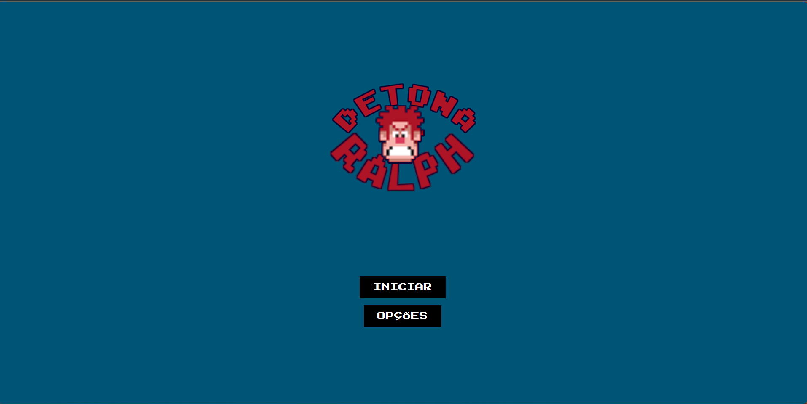
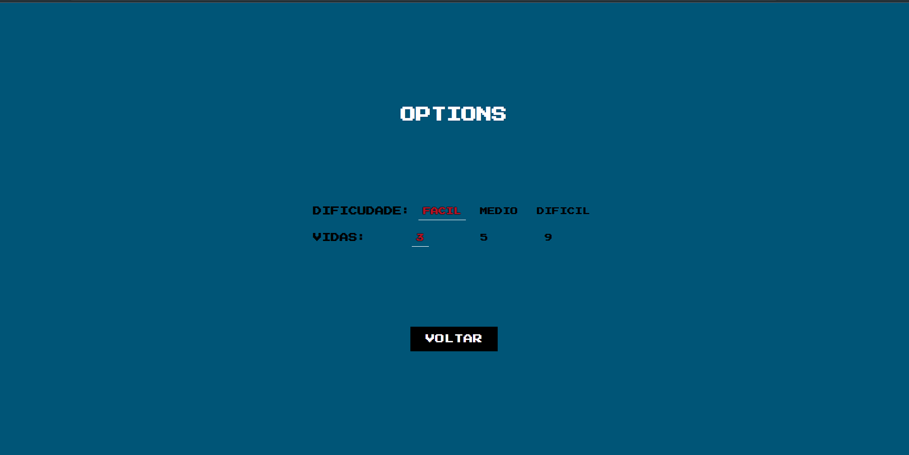
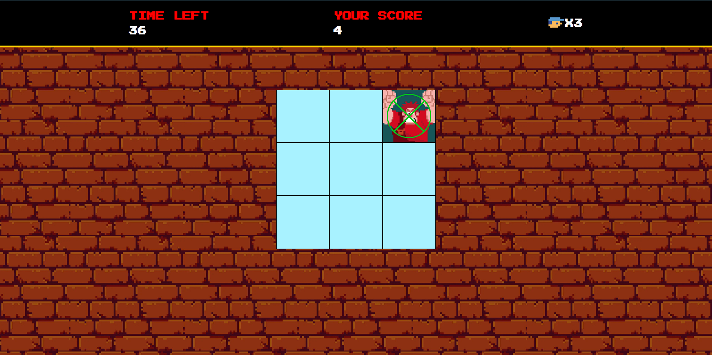

# Jogo Detona Ralph

## Projeto feito com javascritp, css e HTML.

Ele é um jogo simples com o objetivo de clicar no quadrado com a imagem do Ralph.
Se o jogador acertar irá ouvir um som de moeda e um círculo vai aparecer na frente da imagem,
caso o jogador erre irá ouvir um som de dor e irá perder uma vida. Inicialmente são 3 vidas mas poderá aumentar na tela de opções do menu inicial,
também nessa tela tem a opção de dificuldade, que irá aumentar a velocidade com que a imagem aparece.

## Telas do jogo

### Tela inicial do jogo

### Tela de Opções

### Tela do jogo 

## Instruções

### Siga os passos abaixo para inicializar o projeto em seu ambiente local: 

<ol>
  
<li>
  <h4>
    Clone o diretório
  </h4>
  
    git clone https://github.com/Kleby/Javascript-Jogo-detona-ralph.git 
</li>  
<li>
  Selecione o seu diretório local para clonar
</li>
<li>
  Abra o diretório e execulte o index.html em um browser de sua preferência
</li>
</ol>

## Abrir o jogo Remotamente

<a href="#"  target="_blank"> Abra Esse link para ser redirecionado a página remota do jogo </a>
